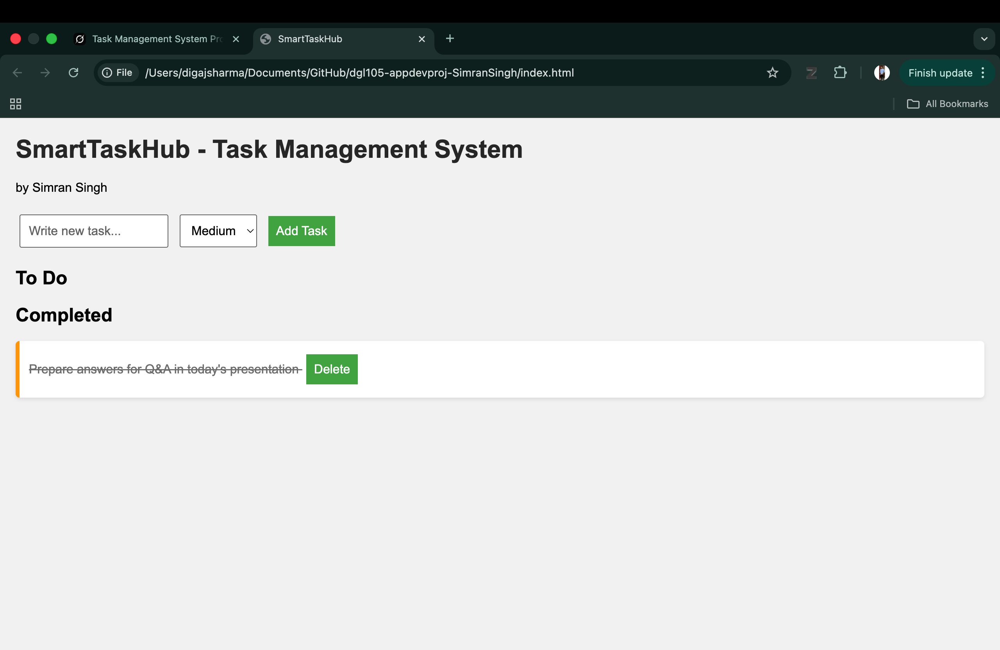
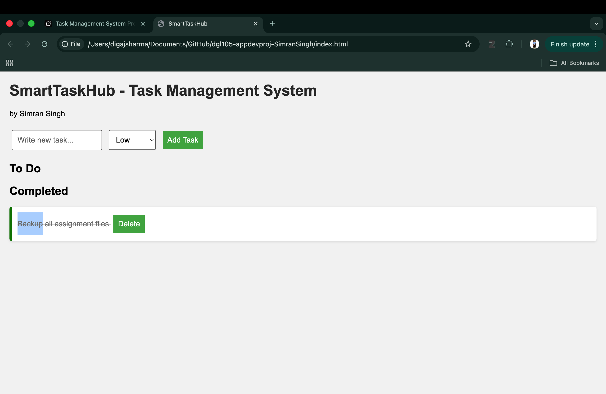
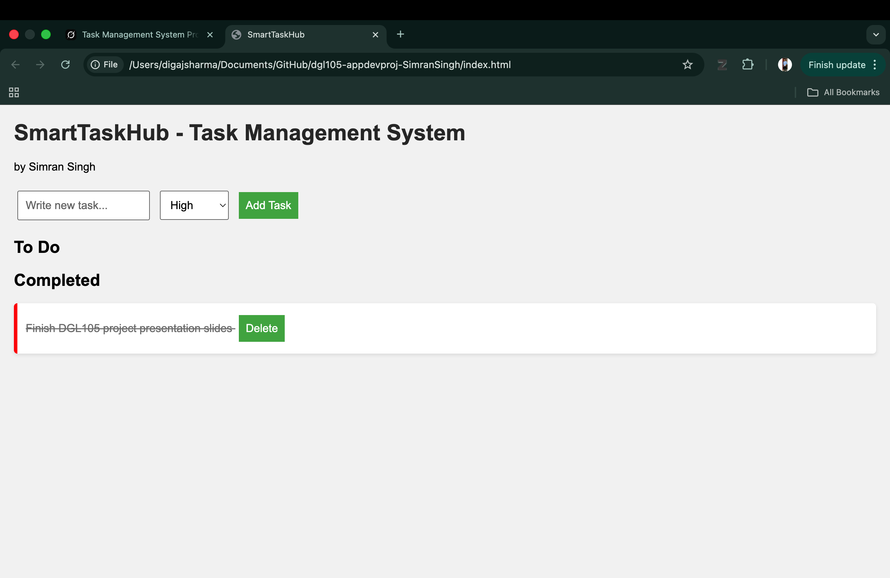
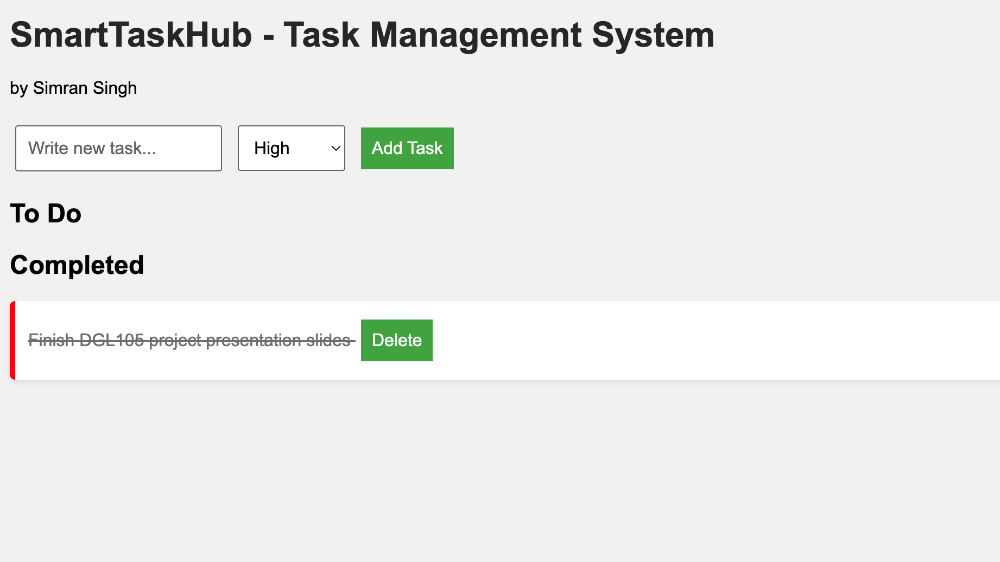

# SmartTaskHub - Task Management System

**Author:** Simran Singh  
**Course:** DGL104 Application Development  
**Submission Date:** 7 April 2026

## Project Description
SmartTaskHub is a simple Task Management System built using HTML, CSS, and JavaScript.

## Features
- Add new tasks with priority (High, Medium, Low)
- Mark tasks as "Done"
- Delete tasks
- Color-coded priority (High = Red, Medium = Orange, Low = Green)

## How to Run
1. Open the `index.html` file in any web browser (Chrome or Safari)
2. No installation or server needed

## Technologies Used
- HTML5
- CSS3
- JavaScript

## Screenshots
 
 
 
 

## Future Improvements
- Add localStorage so tasks stay after refresh
- Add due dates
- Create a Kanban board view

Thank you!
